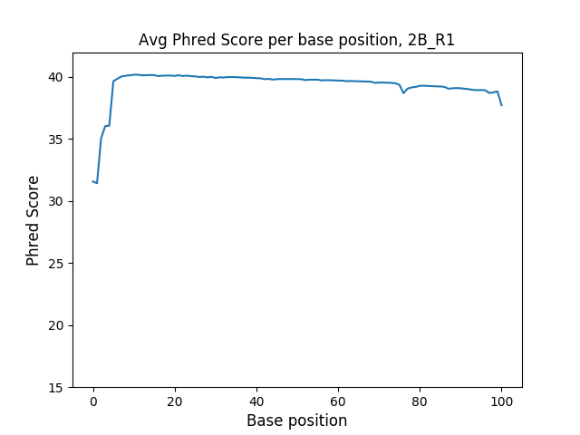
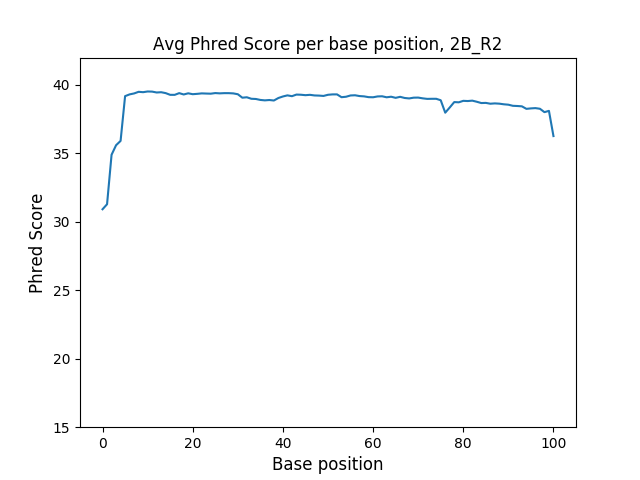
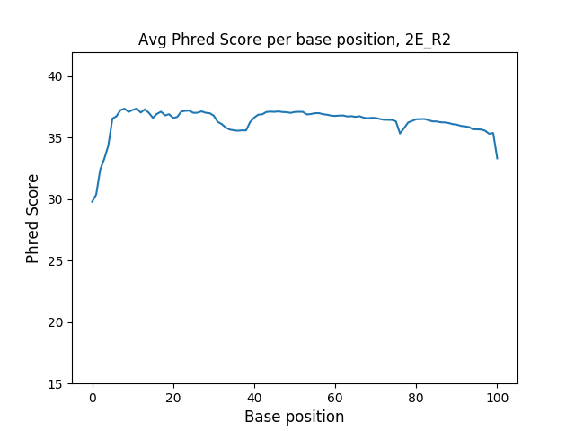

```{r setup, include=FALSE}
knitr::opts_chunk$set(echo = TRUE, eval=F)
```

### Part 1

**1. Run FastQC on our 4 files**

```{bash}
ml easybuild intel/2017a FastQC
fastqc -o . --noextract /projects/bgmp/2017_sequencing/demultiplexed/2_2B_control_S2_L008_R1_001.fastq.gz /projects/bgmp/2017_sequencing/demultiplexed/2_2B_control_S2_L008_R2_001.fastq.gz /projects/bgmp/2017_sequencing/demultiplexed/7_2E_fox_S6_L008_R1_001.fastq.gz /projects/bgmp/2017_sequencing/demultiplexed/7_2E_fox_S6_L008_R2_001.fastq.gz 

```

**Quality Score Distributions and Per-Base N Content**

**2_2B_control R1**


**2_2B_control R2**


**7_2E_fox R1**


**7_2E_fox R2**


It is hard for me to say whether per-base N plots are consistent with the quality score plots, since each of the per-base N plots follows the same pattern (~1% at base 1, then <1% at all of the following bases), even in 7_2E_fox R2, which had a lower overall per-base quality than the other reads. However, it is consistent in that each library starts with a lower average quality score, meaning we probably would also expect to see more N's in that section of the read.

**2. I also evaluated the files using my barhopping.py script from the index hopping assignment. barhopping.py is included with this assignment**

**2_2B_control R1**



**2_2B_control R2**



**7_2E_fox R1**


**7_2E_fox R2**




The FastQC results match up to my own with regards to the quality plots. However, the FastQC plots are more refined, with error bars and such, and were generated much quicker than mine (<10 min vs. ~30 min). This is probably because FastQC is written in Java, while my program is a relatively rudimentary implementation in Python.

### Part 2

**3.** 

**Adapter sequences**

R1 adapter (3'): GATCGGAAGAGCACACGTCTGAACTCCAGTCACNNNNNNNNATCTCGTATGCCGTCTTCTGCTTG

R2 adapter (#'): AATGATACGGCGACCACCGAGATCTACACNNNNNNNNACACTCTTTCCCTACACGACGCTCTTCCGATC

R2 revcomp (3'): GATCGGAAGAGCGTCGTGTAGGGAAAGAGTGTNNNNNNNNGTGTAGATCTCGGTGGTCGCCGTATCATT

```{bash}
cutadapt -a GATCGGAAGAGCACACGTCTGAACTCCAGTCACNNNNNNNNATCTCGTATGCCGTCTTCTGCTTG
-A GATCGGAAGAGCGTCGTGTAGGGAAAGAGTGTNNNNNNNNGTGTAGATCTCGGTGGTCGCCGTATCATT
-o fastq-out/2B-R1.fastq -p fastq-out/2B-R2.fastq
/projects/bgmp/2017_sequencing/demultiplexed/2_2B_control_S2_L008_R1_001.fastq.gz 
/projects/bgmp/2017_sequencing/demultiplexed/2_2B_control_S2_L008_R2_001.fastq.gz 

cutadapt -a GATCGGAAGAGCACACGTCTGAACTCCAGTCACNNNNNNNNATCTCGTATGCCGTCTTCTGCTTG
-A GATCGGAAGAGCGTCGTGTAGGGAAAGAGTGTNNNNNNNNGTGTAGATCTCGGTGGTCGCCGTATCATT
-o fastq-out/2E-R1.fastq -p fastq-out/2E-R2.fastq
/projects/bgmp/2017_sequencing/demultiplexed/7_2E_fox_S6_L008_R1_001.fastq.gz
/projects/bgmp/2017_sequencing/demultiplexed/7_2E_fox_S6_L008_R2_001.fastq.gz
```

**4. Plot length distribution of trimmed reads**

Make length distributions of resulting files

```{bash}
cat 2B-R1.fastq | grep -E -A 1 --no-group-separator "^@K00337" | grep -v "^@K00337" | awk '{print length($0);}' | sort | uniq -c > 2B-R1-len.txt

cat 2B-R2.fastq | grep -E -A 1 --no-group-separator "^@K00337" | grep -v "^@K00337" | awk '{print length($0);}' | sort | uniq -c > 2B-R2-len.txt

cat 2E-R1.fastq | grep -E -A 1 --no-group-separator "^@K00337" | grep -v "^@K00337" | awk '{print length($0);}' | sort | uniq -c > 2E-R1-len.txt

cat 2E-R2.fastq | grep -E -A 1 --no-group-separator "^@K00337" | grep -v "^@K00337" | awk '{print length($0);}' | sort | uniq -c > 2E-R2-len.txt
```

Plot the length distributions

```{R, eval=T}
BR1<-read.table("myfiles/2B-R1-len.txt")
BR2<-read.table("myfiles/2B-R2-len.txt")
{plot(log(BR1$V1, 10)~BR1$V2, pch=4, col="darkred", xlab="Length of trimmed read", ylab="log10(number of reads)", main = "Length distribution of trimmed reads, 2B control")
points(log(BR2$V1, 10)~BR2$V2, pch=4, col="dodgerblue")
legend(0, 7, legend = c("R1", "R2"), col=c("darkred", "dodgerblue"), pch=4)}

ER1<-read.table("myfiles/2E-R1-len.txt")
ER2<-read.table("myfiles/2E-R2-len.txt")

{plot(log(ER1$V1, 10)~ER1$V2, pch=4, col="darkred", xlab="Length of trimmed read", ylab="log10(number of reads)", main = "Length distribution of trimmed reads, 2E fox")
points(log(ER2$V1, 10)~ER2$V2, pch=4, col="dodgerblue")
legend(0, 7, legend = c("R1", "R2"), col=c("darkred", "dodgerblue"), pch=4)}
```

**5. Are these graphs consistent with the fragment analyzer?**

These distributions were not quite what I expected. I had libraries 2_2B and 7_2E, which both contained roughly similar amounts of reads (~5.75M vs. ~5.25M), but the fragment analyzer results for 2_2B shows a tighter distribution between 300-1000 bp, while 7_2E shows a clear lip between 200-300bp. However, you see ~35,000 reads that have been trimmed to 0 in 2_2B and only about ~250 which have been trimmed to 0 in the 7_2E sample. Based on the fragment analyzer, I would have expected the opposite result.

### Part 3

**6. Find rRNA sequences from mouse, build BLAST db and BLAST against our reads**

Download ncRNA file, fix the fasta using fixfasta.py, and extract rRNA sequences. fixfasta.py is included with this assignment.

```{bash}
wget ftp://ftp.ensembl.org/pub/release-90/fasta/mus_musculus/ncrna/Mus_musculus.GRCm38.ncrna.fa.gz

./fixfasta.py -i Mus_musculus.GRCm38.ncrna.fa -o Mouse-ncRNA.fa

grep --no-group-separator -A 1 "rRNA" Mouse-ncRNA.fa > Mouse-rRNA.fa 
```

Build gsnap database on our rRNA db, run gsnap on both paired sets, then use sam-parse.py to determine the number and percent of mapped/unmapped reads. sam-parse.py is included with the assignment.

```{bash}
module load gmap-gsnap/2017-09-11

gmap_build -D db/ -d Mouse-rRNA Mouse-rRNA.fa

gsnap -D db/Mouse-rRNA/ -d Mouse-rRNA -N 1 -t 12 -A sam --allow-pe-name-mismatch fastq-out/2B-R1.fastq fastq-out/2B-R2.fastq > 2_2B_rRNA.sam

gsnap -D db/Mouse-rRNA/ -d Mouse-rRNA -N 1 -t 12 -A sam --allow-pe-name-mismatch fastq-out/2E-R1.fastq fastq-out/2E-R1.fastq > 7_2E_rRNA.sam

./sam-parse.py -i 2_2B_rRNA.sam 
Unmapped: 11399705
Mapped: 46015
% Mapped: 0.4020280069755332

./sam-parse.py -i 7_2E_rRNA.sam 
Unmapped: 10314132
Mapped: 241195
% Mapped: 2.2850547406063306
```

**7.** Demonstrate that the SF-seq data is strand-specific

```{bash}

```

~